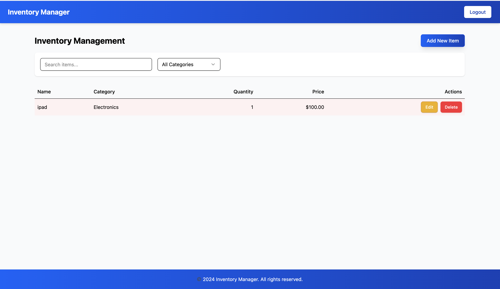

# React Inventory Management System

A modern inventory management system built with React, TypeScript, and Vite. Features a clean UI with real-time updates, filtering, and sorting capabilities.

## Features

- ✨ Add, edit, and delete inventory items
- 🔍 Search items by name
- 🏷️ Filter by category
- ↕️ Sort by quantity
- 🚨 Low stock warnings (items < 10)
- 🎯 Form validation with Zod
- 📱 Responsive design
- 🔔 Toast notifications

## Tech Stack

- React 18
- TypeScript
- Vite
- Radix UI Components
- React Hook Form
- Zod Validation
- Tailwind CSS

## Getting Started

1. Clone the repository:

```bash
git clone <repository-url>
cd inventory-management
```

2. Install dependencies:

```bash
npm install
```

###Note:Please go to https://tailwindcss.com/docs/installation/using-vite to properly configure tailwind for the project

3. Start the development server:

```bash
npm run dev
```

4. Build for production:

```bash
npm run build
```

## Project Structure

```
src/
├── components/
│   ├── inventory/     # Inventory-related components
│   ├── layout/        # Layout components
│   └── ui/            # Reusable UI components
├── hooks/             # Custom React hooks
├── types/             # TypeScript type definitions
└── App.tsx           # Main application component
```

## Screenshot and Recording of working Project

###Screenshot



### Recording

https://drive.google.com/file/d/1tphL8Uf2gAhBfT9vu_GHUyC4StmjFi5z/view?usp=sharing
